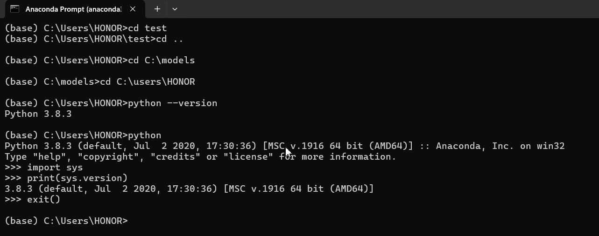
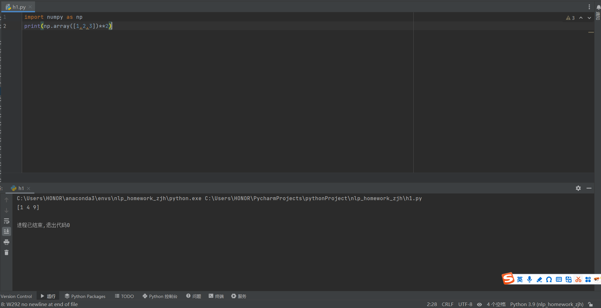

# 喜羊羊的自我介绍


大家好，我是喜羊羊，我的身份是*羊村村民*,以下是我的自我介绍：

---

## 基础档案

### 外貌特征

- 脖子上戴着铃铛

- 穿带有蓝色、白色的鞋子

### 我的朋友

1. 懒羊羊 
2. 暖羊羊 
3. 沸羊羊
4. 美羊羊
5. ~~小灰灰~~

### 重要坐标

- 🏠**住址**:[青青草原](https://baike.baidu.com/item/%E9%9D%92%E9%9D%92%E8%8D%89%E5%8E%9F/18834)

### 日常作息表

|  时间  |  事项   |
|:----:|:-----:|
|  上午  | 学习、探索 |
|  中午  | 休息、社交 |
|  下午  | 冒险、挑战 |
|  晚上  | 晚餐、休息 |

### 人生信条

> 勇敢担当、团结合作

## 我的专业是人工智能

---

## 我最喜欢的一段代码

```import numpy as np```

```print(np.array([1,2,3])**2)```

其中执行```print(np.array([1, 2, 3]) ** 2)```可输出结果

我最喜欢的环境是conda   
“01环境搭建的截图一"   
  
我可以在IDE上使用我建立的虚拟环境   
"01环境搭建的截图二"  

